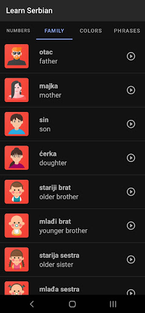
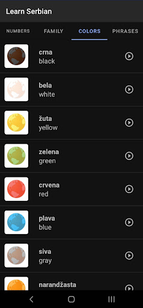
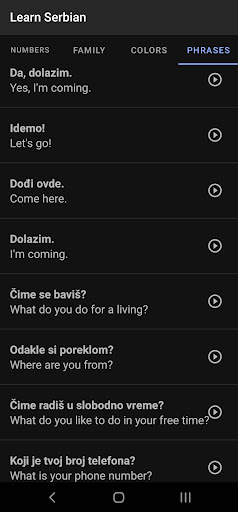
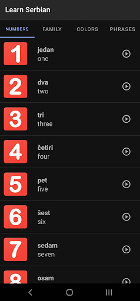

# Learn Serbian App
===================================

This app have translation for common words in Serbia. Audio support included.

Pre-requisites
--------------

- Android SDK v24
- Android Build Tools v23.0.3
- Android Support Repository v24.1.1

Getting Started
---------------

This sample uses the Gradle build system. To build this project, use the
"gradlew build" command or use "Import Project" in Android Studio.

Screenshoots
---------------
    
